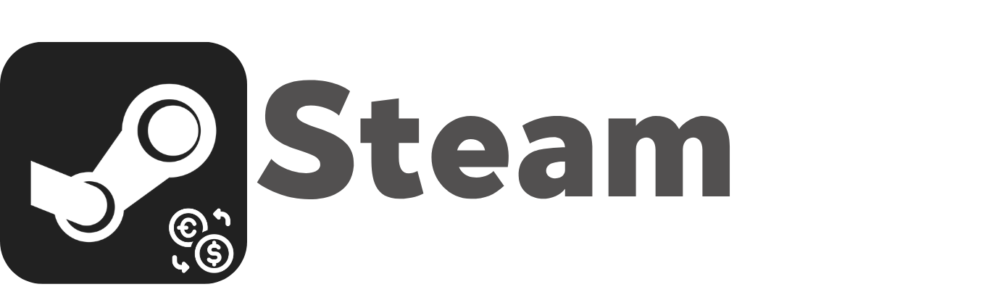

  

  Steam store prices in your own currency, with live exchange rates.

 

Steam FX puts a converted price next to every price on the Steam store. No account, no API key, no sign-up. Pick a currency and browse.

It comes in two parts: a browser extension for the Steam website, and a Windows tray app that does the same inside the Steam app.

Not affiliated with Valve or Steam. This is an independent community project.

## What's in here

- [`extension/`](extension): the browser extension. Works in Chrome, Edge, Brave and other Chromium browsers.
- [`desktop/`](desktop): the Windows tray app. It converts prices inside the Steam app and you change settings from the tray icon.
- [`docs/`](docs): the user guide and the Chrome Web Store listing text.

## Try it

**Browser extension**

1. Download the latest `steam-fx-extension` zip from [the latest release](https://github.com/pozii/SteamFX/releases/latest) and unzip it. (Or clone the repo and use the [`extension/`](extension) folder.)
2. Go to `chrome://extensions` (or `edge://extensions`) and switch on **Developer mode**.
3. Hit **Load unpacked** and choose the unzipped folder.
4. Click the Steam FX icon, pick a currency under **Convert to**, and open the Steam store.

**Windows tray app**

1. Download `SteamFX-Setup-<version>.exe` from [the latest release](https://github.com/pozii/SteamFX/releases/latest) and run it.
2. Steam FX sets itself up for the Steam app right away. Restart Steam once when it asks.
3. Pick your currency from the tray icon.

The tray app updates itself, and each release ships both parts under one version number.

There's a longer walkthrough in the [guide](docs/GUIDE.md). Removing the tray app takes everything with it; see [desktop/README.md](desktop/README.md) for the details.

## How it works

Exchange rates come from [open.er-api.com](https://www.exchangerate-api.com/docs/free), which is free and needs no key. They refresh in the background every 6 hours. There's no built-in currency list; you can pick anything the API returns (around 160 at the moment).

Steam FX guesses the currency Steam is showing you from your region cookie and the price metadata on the page. If it guesses wrong, set it by hand in the popup.

Conversion happens right on the page, on game pages, search results and discount listings. Stuff that loads later (infinite scroll, filters) gets converted as it shows up.

## Contributing

Bug reports and pull requests are welcome. Have a look at [CONTRIBUTING.md](CONTRIBUTING.md) first.

## Privacy

Steam FX doesn't collect any personal data. Details are in [PRIVACY_POLICY.md](PRIVACY_POLICY.md).
